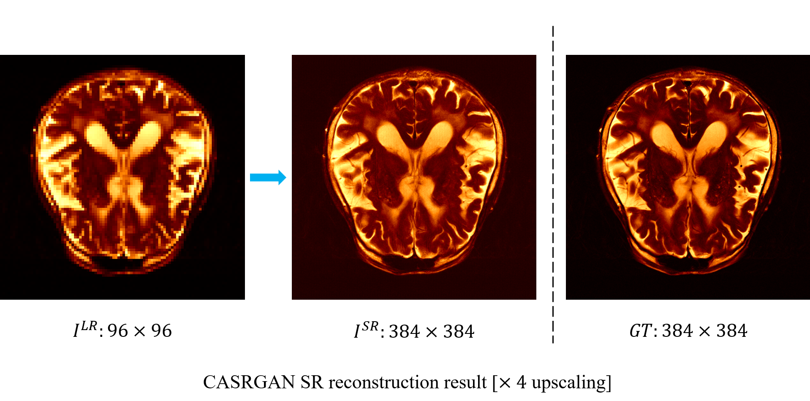
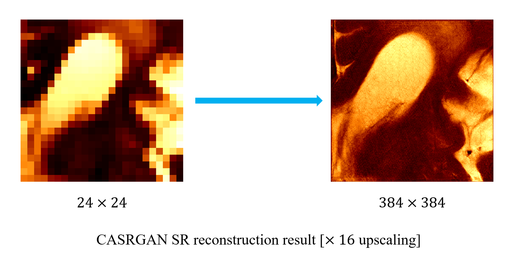
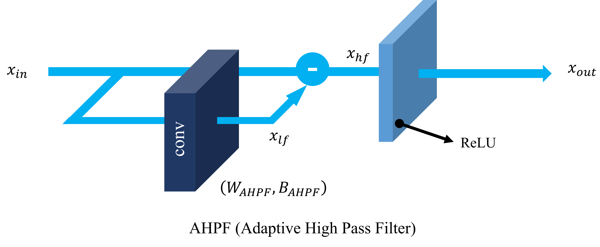

# MRI Super-Resolution GAN with Combined Attention (CASRGAN)





All networks are trained on a NVIDIA Tesla A100 GPU using 11 thousand images from the [fastMRI dataset](https://fastmri.med.nyu.edu/).  


## 1 Implementation

### 1.1 Preparing the Data

* run the following command in the terminal to generate gray scale LR images with reduced size

```
>>> python downsample.py -g --hr_dir <source_hr_img_directory> --lr_dir <target_lr_img_directory>
```

* if intend to generate gray scale LR images and use bicubic interpolation to upscale which to the high-resolution size, add option

```
-k
```

P.S. More options can be found in `downsample_options.py`  in package `options`

### 1.2 Training the Networks

* run the following command in the terminal when training  `model`[srcnn | drrn | edsr | rdn | casr] with super-resolution  `scale`[2 | 3 | 4]

```
>>> python train.py --model <model> --scale <scale>
```

* run the following command in the terminal when training a GAN with  `model`[srcnn | drrn | edsr | rdn | casr] as generator with super-resolution `scale`[2 | 3 | 4]

```
>>> python train.py --model <model> --scale <scale> --gan
```

P.S. More options can be found in `base_options.py` and `train_options.py` in package `options`

**SRCNN**: Dong C, Loy C C, He K, et al. Image super-resolution using deep convolutional networks[J]. IEEE transactions on pattern analysis and machine intelligence, 2015, 38(2): 295-307.

**DRRN**: Tai Y, Yang J, Liu X. Image super-resolution via deep recursive residual network[C]//Proceedings of the IEEE conference on computer vision and pattern recognition. 2017: 3147-3155.

**EDSR**: Lim B, Son S, Kim H, et al. Enhanced deep residual networks for single image super-resolution[C]//Proceedings of the IEEE conference on computer vision and pattern recognition workshops. 2017: 136-144.

**RDN**: Zhang Y, Tian Y, Kong Y, et al. Residual dense network for image super-resolution[C]//Proceedings of the IEEE conference on computer vision and pattern recognition. 2018: 2472-2481.

## 2 About CASRGAN

The combined attention refers to **channel attention** and **self-attention**. We implement the channel attention using a [SE block](https://openaccess.thecvf.com/content_cvpr_2018/html/Hu_Squeeze-and-Excitation_Networks_CVPR_2018_paper.html), and self attention with a modified [Swin Transformer](https://openaccess.thecvf.com/content/ICCV2021/html/Liu_Swin_Transformer_Hierarchical_Vision_Transformer_Using_Shifted_Windows_ICCV_2021_paper) using [DeepNorm ](https://ieeexplore.ieee.org/abstract/document/10496231) to improve its performance as well as stabilize its training.

* **Channel attention**: [Giovanni Luca Marchetti](https://arxiv.org/abs/2312.08550) and others have theoretically demonstrated using group theory that Fourier features emerge in feature maps after convolution operations. Therefore, we believe that employing channel attention mechanisms to specifically emphasize the learning of features associated with certain spatial frequencies and patterns can enhance model performance.
* **Self-attention**: The super-resolution algorithm itself is an ill-posed problem which requires the model to capture abundant contextual information for effective feature reconstruction. Self-attention mechanism is an efficient way to integrate global information, which can help the model dynamically distribute attention globally by calculating dependencies between features, thereby gaining more information for super-resolution reconstruction. Traditional convolutional operations focus mainly on local neighborhoods, which limits the spatial diffusion of information flow, often resulting in inadequate learning of advanced semantic information, such as the difficulty in capturing the similarity of different area textures and complex structures in images. The introduction of self-attention mechanisms allows super-resolution models to consider distant feature relationships while focusing on local features. Therefore, incorporating attention mechanisms can enable models to more comprehensively understand image content.

## 2.1 Generator

P.S. The PyTorch code for the generator is in `CASR_model.py` in package `models`.

### 2.1.1 Architecture


The final CASRGAN generator contains 20 AFEBs (Adaptive Feature Extraction Block) and 1 SAB (Self-Attention Block). The AHPF (Adaptive High Pass Filter) in AFEB is shown below. The RDB is the Residual Dense Block from RDN.

**RDN**: Zhang Y, Tian Y, Kong Y, et al. Residual dense network for image super-resolution[C]//Proceedings of the IEEE conference on computer vision and pattern recognition. 2018: 2472-2481.

#### 2.1.1 AHFP



The proposed AHPF can filter the high spatial frequency of an image. We obtain such information by subtracting the low frequency information gathered by a specially designed convolution layer, whose kernel is set to be:
```math
W_{AHPF} = \left[\begin{matrix}\alpha&\alpha&\alpha\\\alpha&\alpha&\alpha\\\alpha&\alpha&\alpha\\\end{matrix}\right]
```
Where $\alpha$ is the learnable parameter. It can be observed form the below figure that when $\alpha$ approaches $1/9$, the module can output clear high-frequency texture information of the image. As the value of $\alpha$ decreases, the output image increasingly approximates the original image. Thus, by learning $\alpha$, the model can adaptively optimize the value of $\alpha$, learning different levels of high-frequency features from the input for super-resolution reconstruction.


We also introduce a bias in the convolutional layers of the AHFP to work in conjunction with the subsequent ReLU activation layer for noise reduction. This is because when there is a signal around the subject, adding a bias to the overall image can cause the values in the non-subject areas to fall below zero, which are then zeroed out after passing through the ReLU activation. As can be seen from the figure below, $B_{AHPF}$ does not need to be large for the AHFP module to effectively filter out noise signals around the image subject. 

The bias $B_{AHPF}$ in the AHFP layer is also a learnable parameter of the model. When $B_{AHPF}$ is small, the noise reduction capability of AHFP is weaker, but it can retain more feature signals; when $B_{AHPF}$ is large, the image's noise reduction capability is strong, but it may lose some signals. The model can adaptively optimize the bias during the training process to enhance or reduce its noise reduction capability.


#### 2.1.2 SAB

The architecture of the SAB is shown as follow:


Each Swin Transformer module can be roughly divided into two parts: a multi-head attention layer (W-MSA/SW-MSA + LN) and a feed-forward network layer (MLP + LN). Here, the LN layer refers to Layer Normalization, and MLP stands for Multi-Layer Perceptron. W-MSA and SW-MSA are the multi-head attention mechanisms of the Swin Transformer, where W-MSA calculates self-attention within divided windows of features, and SW-MSA calculates attention on windows that are shifted and reorganized, facilitating information connectivity between windows. Thus, the self-attention modules of Swin Transformer always appear in pairs. In CASRGAN, we made two modifications to the original Swin Transformer to achieve better performance and easier training: these are the **addition of a post-LN** and **adjustments to the residual design** ([DeepNorm](https://ieeexplore.ieee.org/abstract/document/10496231)), where $\lambda = (2N)^{1/4}$.

## 2.2 Discriminator

We use a simple classification model as the discriminator:


## 2.3 Loss

Our loss function can be divided into three parts: [**Perceptual Loss**](https://arxiv.org/abs/1603.08155), **GAN Loss** and **Content Loss**.  
```math
L_{total}=L_{percep}+\ \eta_1L_{GAN,G}\ +\eta_2L_{content}
```
Where $\eta_{1}$ and $\eta_{2}$ are constant weights. 

* **Perceptual Loss**

[Perceptual Loss](https://arxiv.org/abs/1603.08155) is an optimization scheme proposed by Li Fei-Fei et al. from Stanford University for image transformation tasks . The core idea is to compare the feature maps obtained from a loss network by both the generated image and the real image, and to use this comparison to optimize the parameters of the generator in reverse. The pre-trained network used for extracting the feature maps does not require parameter updates.

In CASRGAN, we use the VGG19 model pretrained on ImageNet and we use its 17th layer (after convolution, before ReLU activation) output to extract the feature map to calculate the perceptual loss.

* **GAN Loss**

GAN loss is the basic adversarial loss to train a GAN, where we optimize:
```math
L_{GAN,G}=\mathbb{E}\left[-logD\left(G\left(I^{LR}\right)\right)\right]\ \\
L_{GAN,D}=\ -\mathbb{E}\left[log\left(D\left(I^{HR}\right)\right)\right]-\mathbb{E}\left[log\left(1-D\left(G\left(I^{LR}\right)\right)\right)\right]
```

* **Content Loss**

Content loss is used to maintain a relatively high PSNR form the image, and is calculated as:
```math
L_{content} = \mathbb{E}\left[I^{HR}-G\left(I^{LR}\right)\right]] 
```
Which is the L1 loss between the GT image and the reconstructed SR image.

## 2.4 Training

|      |  #   | io_nc | #ST  | embedded dim | patch size |  #H  | window size |
| :--: | :--: | :---: | :--: | :----------: | :--------: | :--: | :---------: |
| AFEB |  20  |  128  |  -   |      -       |     -      |  -   |      -      |
| SAB  |  1   |  128  |  2   |      96      |     6      |  6   |      4      |

\# indicates the number of \<xx\>. io_nc means the number of the input and output channels. #H means the number of heads used in the multi-head attention.

We set $\eta_{1} = 5\times10^{-3}$ and $\eta_{2} = 1\times10^{-2}$ for loss calculation.


The training process can be divided into two parts:

**In the first step**, we pretrain the generator of CASRGAN using the L1 loss on the dataset. To stabilize the training of the Transformer, we initialize the parameters of the Swin Transformer modules using the initialization scheme proposed in [DeepNorm ](https://ieeexplore.ieee.org/abstract/document/10496231), where the parameters in the modules are initialized to a Xavier distribution with a $\beta$ gain: $\beta = (8N^{-1/4})$ , where N is the number of Swin Transformer modules. The model's learning rate is set to be $1\times10^{-4}$, and it is adjusted linearly to halve every 30 epochs, with the training lasting for 60 epochs. Then we negate the modified  $\lambda$ parameter in the Swin Transformer modules (setting $\lambda = 1$), to further refine the model’s self-attention modules and fine-tune the model for an additional 20 epochs.

**In the second step**, we place the pre-trained generator within the GAN structure for joint training with the discriminator, employing the loss functions introduced above, where $\eta_{1} = 5\times10^{-3}$ and $\eta_{2} = 1\times10^{-2}$. The learning rate is set to be $1\times10^{-4}$, and it is adjusted linearly to halve every 30 epochs, with the training lasting for 60 epochs. Additionally, to prevent overfitting, Dropout is implemented in the output fully-connected layer of the Swin Transformer's multi-head attention block and in the multilayer perceptron (MLP) layer of the feed-forward network, with dropout rate of 0.1.
